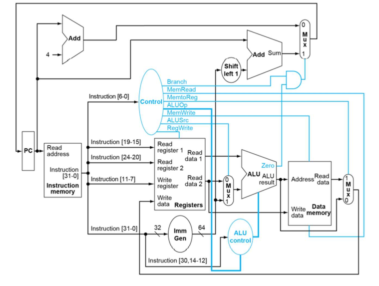
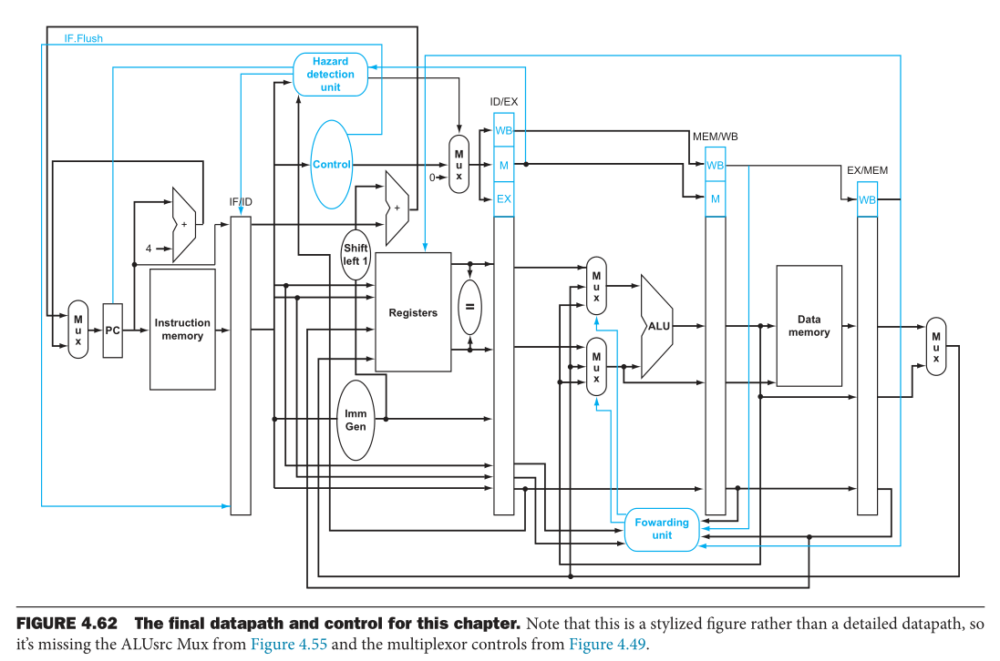

# RISCV_Verilog

This code was finished mainly during my sophomore year within a week, which lacks a good coding style, especially in `single`. 
But the implementation of `pipeline` is carefully verified by a series of test codes provided by TA. 
There might still be some undetected bugs so feel free to come up with any issue.

You can run the code with machine code generated by programs in `assembler`.

The `DEBUGGER` module is used to debug the design with an explicit view of the Register, which should be commented out 
if you like to synthesize or upload the design to an FPGA.

## Build

I build this project using `iverilog` and view the wave file with `gtkwave`. So below building guide will based on above tools.

To start, you have to run the assembler inside `./assembler`, to get the `machinecode.txt`.

### For single

1. Copy the `machinecode.txt` to `./single`.
2. Change directory (cd) to `./single`.
3. Run `iverilog riscv_soc_tb.v -o riscv` to compile.
4. Run `vvp ./riscv` to run the code. You'll notice some outputs and the wave file `wave.vcd`.
5. Use `gtkwave wave.vcd` to view the wave.

### For pipeline

Pretty much the same as above.

1. Copy the `machinecode.txt` to `./pipeline`.
2. Change directory (cd) to `./pipeline`.
3. Run `iverilog riscv_soc_tb.v -o riscv` to compile.
4. Run `vvp ./riscv` to run the code. You'll notice some outputs and the wave file `wave.vcd`.
5. Use `gtkwave wave.vcd` to view the wave.

---

* single schematic

  

* pipeline schematic

  

